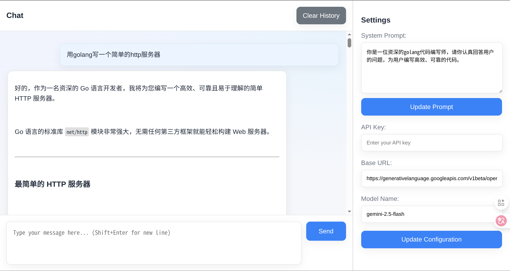
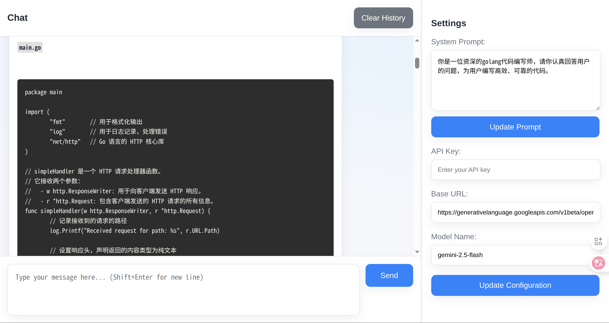
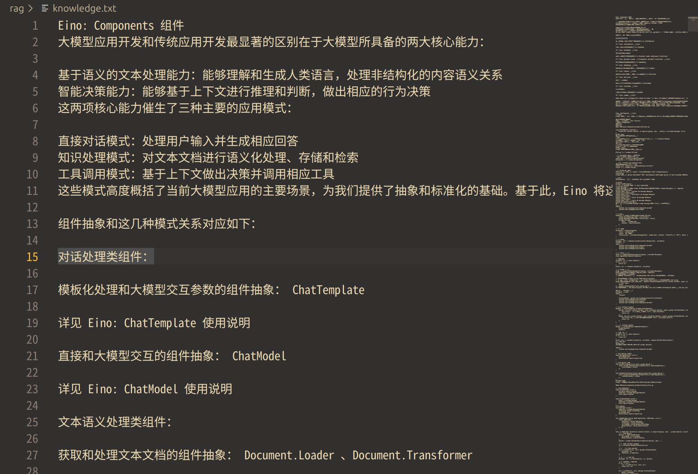
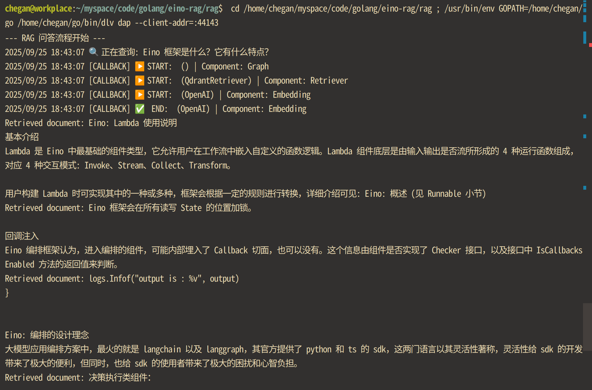

# **Eino-Powered Conversational AI & RAG Knowledge Base**

这是一个基于 [Eino 框架](https://github.com/cloudwego/eino) 构建的综合性大模型应用项目。项目主要包含两大部分：

1. **Go-Chat-Server**：一个功能完备的、支持流式响应的在线聊天应用，拥有独立的前后端实现。  
2. **RAG Knowledge Base**：一个基于检索增强生成（RAG）技术的本地知识库，创新性地集成了 Qdrant 向量数据库，实现了高效的文档检索与智能问答。

这个项目旨在展示如何利用 eino 框架快速构建、编排和扩展复杂的大模型应用，是探索和学习大模型工程化的绝佳实践。

## **✨ 项目亮点**

* **前沿技术栈**：核心采用字节跳动CloudWeGo团队开源的 [Eino](https://github.com/cloudwego/eino) 框架，深度实践其组件化和Graph/Chain编排能力。  
* **完整的对话系统**：Go-Chat-Server 提供了包含前端UI、后端服务、配置管理和历史记录清理在内的全功能对话体验，支持与任意遵循OpenAI API标准的大模型进行交互。  
* **创新的 RAG 实现**：RAG Knowledge Base 模块将 eino 框架与高性能的 Qdrant 向量数据库相结合，实现了高效、可扩展的本地知识库检索。  
* **模块化与解耦**：项目分为两个独立的部分，结构清晰，易于理解、维护和扩展。  
* **工程化实践**：包含了完整的编译、打包和部署脚本 (build\_and\_package.sh, qdrant.sh)，展现了良好的工程化习惯。

## **🚀 功能模块**

### **1\. Go-Chat-Server (在线聊天应用)**

提供了一个美观、易用的Web界面，用于与大语言模型进行实时交互。

**核心功能**:

* **实时流式对话**：后端采用 Server-Sent Events (SSE) 技术，实现了流式输出
* **动态配置**：可在前端界面上动态更新 System Prompt、API Key、Base URL 和 Model Name 等核心配置，无需重启服务。  
* **上下文管理**：支持会话历史记录，并提供一键清空历史记录的功能。  
* **CORS 支持**：内置了基础的 CORS 中间件，方便本地开发和客户端调试。  
* **健康检查**：提供了 /health 接口，便于服务状态监控。

**技术栈**:

* **后端**: Go, gorilla/mux  
* **前端**: HTML, CSS, JavaScript, marked.js (用于Markdown渲染)  
* **核心框架**: eino (openai ChatModel组件)  
* **通信协议**: HTTP, Server-Sent Events (SSE)

### **2\. RAG Knowledge Base (本地知识库)**

一个命令行的知识库问答应用，能够读取本地文件，通过 RAG 技术提供精准的答案。

这是一个eino框架的使用文档

原本大模型不知道eino框架是什么，因为这个框架比较新，很多模型都没有这方面的知识。但使用知识库便得出了答案

**核心功能**:

* **文档处理流水线**：使用 eino 的 Chain 进行编排，实现了从 **加载 (Load)** \-\> **分割 (Split)** \-\> **向量化 (Embed)** \-\> **索引 (Index)** 的完整文档处理流程。  
* **与 Qdrant 集成**：创新地实现了自定义的 QdrantIndexer 和 QdrantRetriever 组件，将 eino 框架与 Qdrant 向量数据库无缝集成。  
* **高效语义检索**：利用 BAAI/bge-m3 模型生成高质量的文本向量，并通过 Qdrant 实现快速、精准的 Top-K 语义检索。  
* **可编排的问答图**：使用 eino 的 Graph 构建 RAG 问答流程，清晰地定义了从 **检索 (Retrieve)** \-\> **提示词构建 (Prompt)** \-\> **LLM 生成 (Generate)** 的每一个步骤。  
* **自定义组件**：项目包含了自定义 EmbeddingTransformer 的实现，展示了 eino 框架强大的扩展能力。

**技术栈**:

* **核心框架**: eino  
* **向量数据库**: Qdrant  
* **大语言模型**: Qwen/Qwen3-8B (或其他兼容模型)  
* **Embedding 模型**: BAAI/bge-m3

## **🔧 如何运行**

### **先决条件**

* Go 1.21+  
* Docker 和 Docker Compose  
* 一个遵循 OpenAI API 标准的大模型服务 endpoint (例如 SiliconFlow, anyscale, a local ollama server 等)  
* 对应的 API Key

### **1\. 运行 Go-Chat-Server**

\# 进入 server 目录  
cd go-chat-server/src

\# 编译并运行后端服务  
go run ./server

\# (或者) 使用打包脚本  
cd go-chat-server  
./build\_and\_package.sh \# 这会编译并将前后端文件打包到 deploy.tar.gz

服务启动后，在浏览器中打开 http://localhost:8080 即可访问前端页面。在右侧的设置区域填入你的大模型服务地址和 API Key 后即可开始对话。

### **2\. 运行 RAG Knowledge Base**

**步骤 1: 启动 Qdrant 向量数据库**

项目提供了便捷的脚本来通过 Docker 启动 Qdrant。

\# 进入 rag 目录  
cd rag

\# 赋予脚本执行权限并运行  
chmod \+x qdrant.sh  
./qdrant.sh

**步骤 2: 配置并运行 RAG 应用**

1. **修改配置**: 打开 rag/main.go 文件，根据你的环境修改顶部的常量配置，特别是 OpenAIAPIKey 和 BaseURL。  
   const (  
       // ... 其他配置  
       BaseURL        \= "\[https://api.siliconflow.cn/v1\](https://api.siliconflow.cn/v1)" // 替换为你的大模型服务地址  
       OpenAIAPIKey   \= "YOUR\_API\_KEY"                  // 替换为你的 API Key  
       // ... 其他配置  
   )

2. **准备知识库文件**: 确保 rag 目录下存在 knowledge.txt 文件。如果不存在，程序会自动创建一个包含示例内容的文件。你可以将任何纯文本文档放入其中。  
3. **运行程序**:  
   \# 确保你在 rag 目录下  
   go run main.go

程序会自动加载 knowledge.txt，将其处理后存入 Qdrant，然后针对预设的问题 "Eino 框架是什么？它有什么特点？" 进行一次完整的 RAG 查询，并打印结果。

## **💡 未来展望**

* 将 Go-Chat-Server 与 RAG Knowledge Base 进行整合，实现在一个UI中既能进行开放式对话，也能进行基于特定知识的问答。  
* 为 RAG 模块增加文件上传接口，允许用户通过界面动态管理知识库。  
* 探索 eino 框架更高级的编排能力，例如实现 ReAct Agent 或构建多智能体系统。